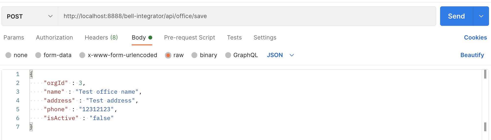

# Bell-Integrator-Project

### REST веб-сервис, предоставляющий CRUD-операции для получения, сохранения, изменения организаций, офисов и пользователей  

Веб-сервис также предоставляет вспомогательные справочные запросы для получения списка<br>
стран с названием страны и её кодом, а также для получения списка типов документов с<br>
названием документа и его кодом

### API
* [Справочные запросы](#справочные-запросы)
* [Запросы, связанные с организациями](#запросы-связанные-с-организациями)
* [Запросы, связанные с офисами](#запросы-связанные-с-офисами)
* [Запросы, связанные с пользователями](#запросы-связанные-с-пользователями)
* [Как отправлять запросы](#как-отправлять-запросы)
* [Как запустить](#как-запустить)

### Справочные запросы
* Справочный GET-запрос для получения списка стран и их кодов

`/bell-integrator/api/countries`

Пример запроса:


Результат: JSON формата  
```
{
   "data": [
       {
           "name": "Название страны 1",
           "code": "Код страны 1"
       },
        ...
        ...
        ...
        ,
       {
           "name": "Название страны N",
           "code": "Код страны N"
       }
   ]
}
```


* Справочный GET-запрос для получения списка типов документов и их кодов

`/bell-integrator/api/docs`

Пример запроса:


Результат: JSON формата  
```
{
    "data": [
        {
            "name": "Название типа документа 1",
            "code": "Код типа документа 1"
        },
         ...
         ...
         ...
        ,
        {
            "name": "Название типа документа N",
            "code": "Код типа документа N"
        }
    ]
}
```
Пример ответа:
```
{
    "data": [
        {
            "name": "Свидетельство о рождении",
            "code": "03"
        },
        {
            "name": "Военный билет",
            "code": "07"
        },
        {
            "name": "Временное удостоверение, выданное взамен военного билета",
            "code": "08"
        },
        {
            "name": "Паспорт иностранного гражданина",
            "code": "10"
        },
        {
            "name": "Свидетельство о рассмотрении ходатайства о признании лица беженцем на территории Российской Федерации по существу",
            "code": "11"
        },
        {
            "name": "Вид на жительство в Российской Федерации",
            "code": "12"
        },
        {
            "name": "Удостоверение беженца",
            "code": "13"
        },
        {
            "name": "Разрешение на временное проживание в Российской Федерации",
            "code": "15"
        },
        {
            "name": "Свидетельство о предоставлении временного убежища на территории Российской Федерации",
            "code": "18"
        },
        {
            "name": "Паспорт гражданина Российской Федерации",
            "code": "21"
        },
        {
            "name": "Свидетельство о рождении, выданное уполномоченным органом иностранного государства",
            "code": "23"
        },
        {
            "name": "Удостоверение личности военнослужащего Российской Федерации",
            "code": "24"
        },
        {
            "name": "Иные документы",
            "code": "91"
        }
    ]
}
```

### Запросы, связанные с организациями

* GET-запрос для получения списка всех организаций

`/bell-integrator/api/organization/list`

Пример запроса:


Пример ответа:
```
{
    "data": [
        {
            "id": 1,
            "name": "Рога и копыта",
            "fullName": "ООО \"Рога и копыта\"",
            "inn": "1122334455",
            "kpp": "111222333",
            "address": "г. Москва, ул. Ленина, д. 1",
            "phone": "+71234567890",
            "isActive": "true"
        },
        {
            "id": 2,
            "name": "Парикмахерская \"Светлана\"",
            "fullName": "ИП Светлана Сидорова",
            "inn": "223344556677",
            "kpp": "666777888",
            "address": "г. Владимир, ул. Пушкина, д. 2",
            "phone": "+74564567809",
            "isActive": "true"
        },
        {
            "id": 3,
            "name": "ТРАНССИБСТАЛЬМАШ",
            "fullName": "ЗАО \"ТРАНССИБСТАЛЬМАШ\"",
            "inn": "3344556677",
            "kpp": "333444555",
            "address": "г. Челябинск, ул. Советская, д. 3",
            "phone": "+79874568725",
            "isActive": "true"
        }
    ]
}
```

* GET-запрос для получения организации по идентификатору

`/bell-integrator/api/organization/{orgId}`

Пример запроса:


Пример ответа:
```
{
    "data": {
        "id": 3,
        "name": "ТРАНССИБСТАЛЬМАШ",
        "fullName": "ЗАО \"ТРАНССИБСТАЛЬМАШ\"",
        "inn": "3344556677",
        "kpp": "333444555",
        "address": "г. Челябинск, ул. Советская, д. 3",
        "phone": "+79874568725",
        "isActive": "true"
    }
}
```

* POST-запрос для сохранения информации об организации

`/bell-integrator/api/organization/save`

Пример запроса:


Пример ответа:

1) В случае успешного завершения операции будет выведено сообщение об успехе:

```
{
    "data": {
        "result": "success"
    }
}
```

2) Иначе будет выведено сообщение об ошибке:
```
{
    "error": "Текст ошибки"
}
```

* PUT-запрос для обновления информации об организации

`/bell-integrator/api/organization/update`

Пример запроса:


Обязательным параметром является "id", остальные параметры можно опускать.

Пример ответа:

1) В случае успешного завершения операции будет выведено сообщение об успехе:

```
{
    "data": {
        "result": "success"
    }
}
```

2) Иначе будет выведено сообщение об ошибке:
```
{
    "error": "Текст ошибки"
}
```

* POST-запрос для фильтрации информации об организациях

`/bell-integrator/api/organization/list`

Пример запроса:


Результатом запроса будут организации, у которых поле "isActive" равняется "true".  
Можно в тело сообщения добавлять дополнительные поля, результатом запроса будут
организации, у которых все поля совпадают.

### Запросы, связанные с офисами

* GET-запрос для получения списка всех офисов

`/bell-integrator/api/office/list`

Пример запроса:


Пример ответа:

```
{
    "data": [
        {
            "id": 1,
            "name": "Главный офис",
            "address": "г. Москва, ул. Ленина, д. 1",
            "phone": "+71234567890",
            "orgId": 1,
            "isActive": "true"
        },
        {
            "id": 2,
            "name": "Офис №2",
            "address": "г. Москва, ул. Ленина, д. 2",
            "phone": "+71234567899",
            "orgId": 1,
            "isActive": "true"
        },
        {
            "id": 3,
            "name": "Салон красоты",
            "address": "г. Владимир, ул. Пушкина, д. 2",
            "phone": "+74564567809",
            "orgId": 2,
            "isActive": "true"
        },
        {
            "id": 4,
            "name": "Центральный офис",
            "address": "г. Челябинск, ул. Советская, д. 3",
            "phone": "+79874568725",
            "orgId": 3,
            "isActive": "true"
        },
        {
            "id": 5,
            "name": "Офис #2",
            "address": "г. Челябинск, ул. Советская, д. 6",
            "phone": "+79874568746",
            "orgId": 3,
            "isActive": "true"
        },
        {
            "id": 6,
            "name": "Склад",
            "address": "г. Челябинск, ул. Советская, д. 12",
            "phone": "+79874568784",
            "orgId": 3,
            "isActive": "true"
        }
    ]
}
```

* GET-запрос для получения информации об офисе по идентификатору

`/bell-integrator/api/office/{officeId}`

Пример запроса:


Пример ответа:

```
{
    "data": {
        "id": 4,
        "name": "Центральный офис",
        "address": "г. Челябинск, ул. Советская, д. 3",
        "phone": "+79874568725",
        "orgId": 3,
        "isActive": "true"
    }
}
```

* POST-запрос для сохранения информации об офисе

`/bell-integrator/api/office/save`

Пример запроса:


Пример ответа:

1) В случае успешного завершения операции будет выведено сообщение об успехе:

```
{
    "data": {
        "result": "success"
    }
}
```

2) Иначе будет выведено сообщение об ошибке:
```
{
    "error": "Текст ошибки"
}
```

* PUT-запрос для обновления информации об офисе

`/bell-integrator/api/office/update`

Пример запроса:


Обязательным параметром является "id", остальные параметры можно опускать.

Пример ответа:

1) В случае успешного завершения операции будет выведено сообщение об успехе:

```
{
    "data": {
        "result": "success"
    }
}
```

2) Иначе будет выведено сообщение об ошибке:
```
{
    "error": "Текст ошибки"
}
```

* POST-запрос для фильтрации информации об офисах

`/bell-integrator/api/office/list`

Пример запроса:


Результатом запроса будут офисы, у которых поле "isActive" равняется "true".  
Можно в тело сообщения добавлять дополнительные поля, результатом запроса будут
офисы, у которых все поля совпадают.

### Запросы, связанные с пользователями

* GET-запрос для получения списка всех пользователей

`/bell-integrator/api/user/list`

Пример запроса:


Пример ответа:

```
{
    "data": [
        {
            "id": 1,
            "officeId": 1,
            "firstName": "Иван",
            "lastName": "Кузнецов",
            "middleName": null,
            "position": "Директор",
            "phone": "+73456789023",
            "docCode": "21",
            "docNumber": "1234567890",
            "docDate": "2020-01-01",
            "citizenshipCode": "643",
            "isIdentified": "true"
        },
        {
            "id": 2,
            "officeId": 2,
            "firstName": "Пётр",
            "lastName": "Смирнов",
            "middleName": null,
            "position": "Зам. директора",
            "phone": "+73456789065",
            "docCode": "21",
            "docNumber": "1234567809",
            "docDate": "2020-03-03",
            "citizenshipCode": "643",
            "isIdentified": "true"
        },
        {
            "id": 3,
            "officeId": 3,
            "firstName": "Светлана",
            "lastName": "Сидорова",
            "middleName": null,
            "position": "Парикмахер",
            "phone": "+74564567809",
            "docCode": "10",
            "docNumber": "123454321",
            "docDate": "2019-05-25",
            "citizenshipCode": "112",
            "isIdentified": "true"
        },
        {
            "id": 4,
            "officeId": 4,
            "firstName": "Виктор",
            "lastName": "Белых",
            "middleName": null,
            "position": "Директор",
            "phone": "+79874568725",
            "docCode": "13",
            "docNumber": "1234567895",
            "docDate": "2018-07-13",
            "citizenshipCode": "804",
            "isIdentified": "true"
        },
        {
            "id": 5,
            "officeId": 5,
            "firstName": "Дмитрий",
            "lastName": "Пчелов",
            "middleName": null,
            "position": "Зам. директора",
            "phone": "+73456787892",
            "docCode": "21",
            "docNumber": "1234658791",
            "docDate": "2016-03-05",
            "citizenshipCode": "643",
            "isIdentified": "true"
        },
        {
            "id": 6,
            "officeId": 6,
            "firstName": "Роман",
            "lastName": "Балашов",
            "middleName": null,
            "position": "Управляющий складом",
            "phone": "+73456785673",
            "docCode": "10",
            "docNumber": "1132435465",
            "docDate": "2019-04-05",
            "citizenshipCode": "398",
            "isIdentified": "true"
        }
    ]
}
```
* GET-запрос для получения информации о пользователе по идентификатору

`/bell-integrator/api/user/{userId}`

Пример запроса:


Пример ответа:
```
{
    "data": {
        "id": 5,
        "officeId": 5,
        "firstName": "Дмитрий",
        "lastName": "Пчелов",
        "middleName": null,
        "position": "Зам. директора",
        "phone": "+73456787892",
        "docCode": "21",
        "docNumber": "1234658791",
        "docDate": "2016-03-05",
        "citizenshipCode": "643",
        "isIdentified": "true"
    }
}
```

* POST-запрос для сохранения информации о пользователе

`/bell-integrator/api/user/save`

Пример запроса:


Пример ответа:

1) В случае успешного завершения операции будет выведено сообщение об успехе:

```
{
    "data": {
        "result": "success"
    }
}
```

2) Иначе будет выведено сообщение об ошибке:

```
{
    "error": "Текст ошибки"
}
```
* PUT-запрос для обновления информации о пользователе

`/bell-integrator/api/user/update`

Пример запроса:


Пример ответа:

1) В случае успешного завершения операции будет выведено сообщение об успехе:

```
{
    "data": {
        "result": "success"
    }
}
```

2) Иначе будет выведено сообщение об ошибке:

```
{
    "error": "Текст ошибки"
}
```

* POST-запрос для фильтрации информации о пользователях

`/bell-integrator/api/user/list`

Пример запроса:


Пример ответа:

Результатом запроса будут пользователи, у которых поле "docCode" равняется "10".  
Можно в тело сообщения добавлять дополнительные поля, результатом запроса будут
пользователи, у которых все поля совпадают.

### Как отправлять запросы
* Для GET-запросов достаточно адресной строки браузера

* Для запросов с телом сообщения можно воспользоваться:
     * [Postman](https://www.postman.com)
     * [Swagger](https://swagger.io)
### Как запустить
* Можно запускать через IDE (например, Intellij IDEA)

* 